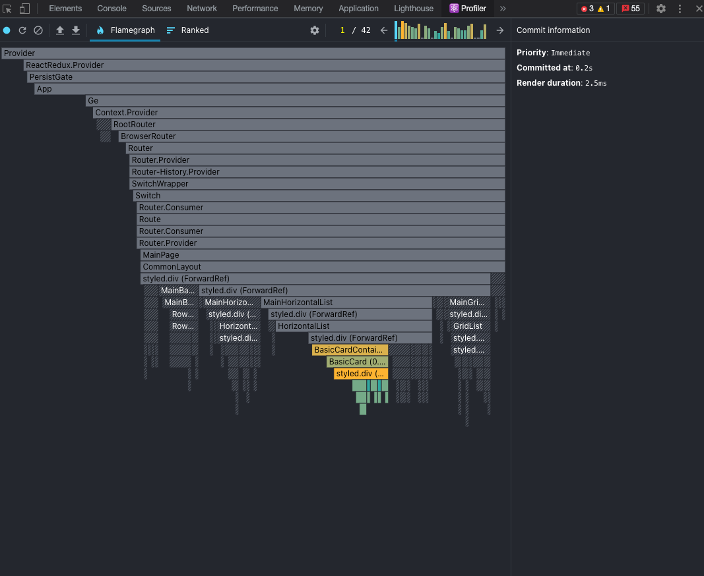
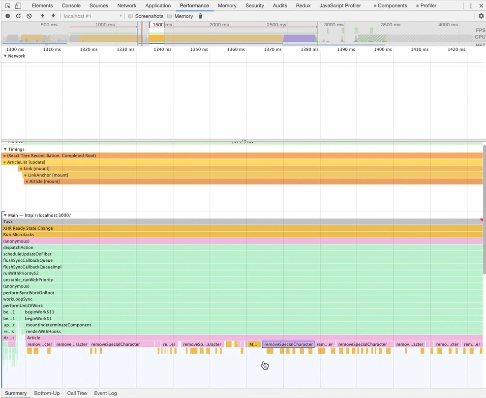

# App단(React) 최적화

## React 렌더링간 최적화

React에서는 state혹은 props, 상태 관리 store의 값이 바뀔 때 리랜더링이 일어난다.  
불필요한 리랜더링이나 동작을 방지하는것은 UX의 향상과 성능에 도움을 줄 수 있다.

### 불변성(immutability)

https://www.howdy-mj.me/redux/right-way-to-update-state/

- 여기서 불변성이란 => 변수가 수정 가능하냐 아니냐라는 정도로만 이해하는건 직관적이지 못하다.
  **한 번 변수를 만들때 메모리에 생긴 값을 다시 수정할 수 있느냐 => 없다** => 그러면 불변함이 유지되는 것
- state의 갱신은 값이 변화했을 때, 즉 특정 값의 메모리 주소가 변화했을 때 감지된다 => 그리고 리랜더링 된다
- 원시 타입(number, string, undefined, null, boolean, symbol)은 그 자체로 불변하다. 새롭게 할당되는
값 마다 새로운 메모리 공간에 저장한다. 즉 값이 다르다면 무조건 메모리 주소도 다르다
- 다만 참조형 타입은 값이 바뀌어도 참조 데이터 자체의 주소가 똑같기 때문에 불변하지 않다.
값이 바뀌어도 React는 변경된 것을 알아차리지 못한다. 따라서 **메모리 주소를 바꾸어 React에게
  데이터가 변경되었다고 알려줘야 한다**

#### [불변값 유지의 효용](https://ljs0705.medium.com/react-state%EA%B0%80-%EB%B6%88%EB%B3%80%EC%9D%B4%EC%96%B4%EC%95%BC-%ED%95%98%EB%8A%94-%EC%9D%B4%EC%9C%A0-ec2bf09c1021)

- **side effect를 줄인다** : 한 번 만든 변수의 값이 수정이 불가능하고 메모리에 계속 남아있다면 부수효과를 줄일 수
  있고, 그 자체로 thread-safe하기 때문에 동기화 문제에서 자유롭다. 두 개의 스레드가 동시에 같은 변수를 수정하려고 하는
  경우를 생각해 보면..
- **효율적이다** : 객체를 state로 넣었고 값의 변화를 감지해야한다고 할때, 이전 객체와 이후 객체의 값 변화를 감지하려면
  일단 이전과 이후 객체의 프로퍼티들을 하나하나 모두 비교해볼 수도 있다. 새로운 키가 추가, 혹은 삭제되
  었는지 비교하고, 값이 달라졌는지 비교하는 등 이렇게 하면 느리다. 불변값으로 유지하면 **객체 변수의 레퍼런스만 
  비교하면 된다**

### [함수형 VS 클래스형 컴포넌트의 state](https://rinae.dev/posts/a-complete-guide-to-useeffect-ko#%EB%AA%A8%EB%93%A0-%EB%9E%9C%EB%8D%94%EB%A7%81%EC%9D%80-%EA%B3%A0%EC%9C%A0%EC%9D%98-%EB%AA%A8%EB%93%A0-%EA%B2%83%EC%9D%84-%EA%B0%80%EC%A7%80%EA%B3%A0-%EC%9E%88%EB%8B%A4)

- 함수형 컴포넌트에서 모든 렌더링은 고유의 변수, 이벤트 핸들러, 이펙트를 가진다.
  리랜더링시 따로 훅으로 처리를 해주지 않는다면 변수와 함수는 모두 **매번 다시 만들어진다.**
- 클래스형 컴포넌트는 클래스의 인스턴스고, 독립적인 멤버변수를 가지기 때문에 모든 멤버변수와 함수들이 
매 랜더링마다 죄다 다시 만들어지지는 않는다(가지고 있다. 그래서 this도 필요한 것)
- 링크의 예제에서 볼 수 있듯클래스형 컴포넌트의 멤버변수는 매 랜더링마다 값을 가지지 않고,
  상태변화가 일어났을 때 항상 모든 것이 반영된 값을 가진다.

### useMemo, useCallback

- 최적화를 해주지 않은 요소들이 렌더링간 계속 만들어지는 것은 (사실은) 불필요한 동작이다. 따라서 useMemo, useCallback 
훅을 이용해 렌더링에 이용되는 변수, 혹은 함수를 렌더링간 메모이제이션하도록 하여 변수나 함수가
  불필요하게 새롭게 생성되는 것을 막을 수 있다
- 그냥 막 사용하면 **발적화 문제**가 있다. 사실 진짜 성능 문제가 나오기 전까지는 굳이 사용할 필요성이 없을 수도 있다.
  뭐 그 사실 자체는 오래전부터 알고 있긴 했지만
  벤치마크가 궁금해서 좀 찾아봤다
  
#### 그래도 쓸 수 있는 상황이라면

- **재랜더링 방지가 정말 필요한 상황** : 상태 끌어올리기 등을 했을 경우나 여러 하위 컴포넌트들의 상태가
  상위 컴포넌트에서 사용되는 경우 **상태값 변화와 관련 없는 컴포넌트까지도 재랜더링되는 문제**가 일어날 수 있다.
  하위 컴포넌트에 프롭으로 넘겨줘야할 값들이 계속 바뀌는 것을 useMemo, useCallback을 통해 방지하고, 하위 컴포넌트에 
  `React.memo`를 걸어주면 프롭이 실질적으로 바뀔 때만 하위 컴포넌트의 재랜더링이 일어난다
    - prop으로 내리기 전에 레이어를 하나 더 두는 느낌이다
- **레퍼런스 비교** : 의존성 배열이 참조 자료형때문에 제대로 작동하지 못하는 경우가 생길 수 있다.
  useEffect의 의존성 배열로 어떤 값을 관찰해야 할때, 만약 그 값이 객체이고 매 랜더링 마다 새로 생기는 값이라면
  useEffect는 객체의 값이 수정될때 호출되는 게 아니라 그냥 매 랜더링마다 호출되니 별 의미가 없다
    - 하위 컴포넌트에서 쓸데없는 useEffect를 만들지 않기 위해, 상위 컴포넌트에서 객체/함수/배열을 prop으로 내려줄 때 
      useMemo나 useCallback을 이용하여 매 랜더링마다 바뀌지 않는, 값을 만들어서 내려줄 수 있다. 
- **함수를 데이터 흐름 안에 편입시키는 useCallback** : 클래스 컴포넌트의 경우 클래스 컴포넌트 내부에
  선언해놓는 함수들은 클래스의 메소드이기 때문에 상태값이 바뀐다고 해서 함수형 컴포넌트처럼 매번 다시 만들어지거나
  하는 느낌이 아니다. 클래스형 컴포넌트에서는 함수의 실질적인 차이를 알기 위해 다른 프롭을 넘겨줘야 하는
  경우도 빈번했다.
    - 이런 경우에 클래스 컴포넌트에서는 실제로 데이터 흐름에서 차지하는 부분이 없음. 다만 useCallback을 
  사용하면 어떤 경우에 이 함수가 저번이랑 다른지를 알 수 있게 되어 데이터 흐름에서 부분을 차지하게 됨

### case) context API의 재렌더링 문제

- provider의 value의 레퍼런스가 바뀔 경우 provider 밑에 있는 친구들이 모두 리랜더링되는 불상사가 
벌어지기 때문에 value를 최적화하는게 필요할 수 있다
- useContext를 사용하는 컨슈머 컴포넌트의 경우 context로 받는 값이 바뀔 경우 컴포넌트 함수가 호출이 되기는 
하는듯
- context를 분할하여 구독이 꼭 필요한 컴포넌트들만 감싸주거나, useMemo, memo를 사용한 캐싱으로 최적화를 수행
할 수 있다.
- 리덕스에서는 컴포넌트에서 글로벌 상태의 특정 값을 의존하게 될 때(useSelector 같은 것으로) 해당 값이 바뀔 
때만 리렌더링되게끔 최적화가 되어 있어 글로벌 상태 중에 의존하지 않는 값이 바뀌게 될 때에는 컴포넌트에서 낭비
  되는 렌더링이 발생하지 않는다. 반면 context는 이러한 성능 최적화가 이루어지지 않아서, 컴포넌트에서 만약 Context의
  특정 값을 의존하는 경우, 해당 값 말고 다른 값이 변경될 때에도 컴포넌트에서는 리렌더링이 발생하게 됨

### case) 비동기 요청 response의 경우

- 일단 매 호출마다 새로운 객체가 만들어질 것이고 그걸 state에 넣거나 Redux store에 변화를 만드니 재랜더링이 된다

### React.memo()

- 일단은 상위 컴포넌트의 state가 바뀌면 무조건 리랜더링이 된다. 하위 컴포넌트를 React.memo로 감싸면
pure component처럼 실질적으로 prop이 바뀔 때만 렌더링이 된다
- **어떨 때 써야 하나** : 같은 props로 렌더링이 자주 일어나는 컴포넌트, 상위 컴포넌트의 상태값 변화 때문에 하위 컴포넌트가
  항상 prop이 같아도 재랜더링이 매우 자주 일어나는(거의 초단위로 일어난다거나..) 경우가 있을 수 있다.
- 역시 발적화의 가능성에서 벗어나지 못한다. 성능적인 이점이 없다면 메모이제이션을 사용하지 않는게 좋다. 렌더링
될 때 props가 자주 변하는 대부분의 컴포넌트를 사용하면 메모이제이션의 이점을 얻기 힘들다 오히려 오버헤드가 걸림\
- 렌더링을 막기 위해서 메모이제이션에 의존하면 안된다

### 참고) 의존성 배열에 대한 고찰

## 발적화를 방지하는 프로파일링

### React Devtool

**랜더링 시간과 횟수**

- 리액트의 관점에서 렌더링 완료 까지의 시간(duration) 프레임 차트를 볼 수 있음
- 유용한 옵션 : profiler/설정에 highlight updates when components render을 체크하면 상태값이 바뀔 때마다
재랜더링 되는 컴포넌트의 범위를 볼 수 있음
- recording한 시간에 제랜더링이 일어난 만큼의 모든 렌더링을 차트로 볼 수 있다 
- 최적화를 하는 컴포넌트의 렌더링 듀레이션이 의미 있을 정도로 줄어야 최적화가 효용이 있는 듯 함

### 개발자 도구의 performance

**함수의 실행 시간이나 메모리**

- 퍼포먼스 탭의 recording을 이용
- 페이지 전체의 타임라인, 원하는 해당 스크립트를 선택해서 볼 수 있음
- FP : First Paint
- Audit의 opportunity를 보면 script Evalutation이 얼마나 오래 걸렸는지 알 수 있다. 혹은 자바스크립트 실행
  시간 같은 것도 알 수 있음

#### 병목 코드 찾기

- 프레임 차트의 조각들
- 중간중간에 minor gc때문에 끊겨있는 하나의 함수 호출 : 끊겨있는 작업들, 메모리에서 여러번 gc를 호출 => 메모
  리를 많이 사용하는 작업일 경우 GC가 계속 일어날 수 있다
- 나눠져있는 네트워크 탭도 보면 어디가 병목인지 알 수 있음

## 메모리 관리

### 메모리 누수

https://ui.toast.com/weekly-pick/ko_20210611

- 메모리 누수란 부주의, 또는 일부 프로그램의 오류로 인해 더 사용되지 않는 메모리를 해제하지 못하는
것이다
- 스택 메모리는 원시 타입을 위해, 힙 메모리는 객체 타입을 위해 존재 => 스택 메모리에는 변수와 기본형
자료형이, 힙 메모리에는 스택 메모리들을 가리키는 메모리 주소 전체

### GC

참조 카운트가 0이 되면 메모리가 해제된다

- 함수가 실행을 완료하면 실행 컨텍스트가 종료되고 참조한 변수들에 대한 스택 메모리 공간이 해제
- 로컬 스코프를 떠난 후 해당 스코프의 변수가 외부 스코프에서 참조되지 않으면 나중에 지워진다
참조가 남아있을 경우 클로저가 되고 안 지워진다

### 메모리 관리

- 개발자 도구의 performance 탭에서 메모리 사용량을 확인해볼 수 있다. 라인 차트가 계속 상승하는
추세일 경우 메모리를 지속해서 소비하며 프로그램에서 메모리 누수가 발생할 가능성이 크다
  

### 누수 예제

#### 클로저의 잘못된 사용

- 특정 함수 스코프에서 상위 스코프에서 선언된 변수를 참조할때, 상위 스코프의 실행 컨텍스트가 
종료되도 특정 함수 스코프는 여전히 상위 스코프의 변수를 참조하기 때문에 메모리 해제가 되지 않는다
- 만약 그 변수를 함수 스코프가 종료되었을 때 사용하지 않는다면, 누수가 발생한다

#### 의도치 않게 생성된 전역 변수

- 전역변수는 일반적으로 가비지 컬렉터에 의해 수집되지 않는다. 가능한 한 적게 사용해야 한다
- 선언 없이 변수에 할당한다면 그 변수는 전역에 생성되는 변수가 된다
- 변수를 선언하기 전에 값을 할당하는 것에 조심해야 하며, strict 모드를 사용하는 것이 추천된다

#### 분리된 DOM 노드

- removeChild같은 것으로 돔 노드를 제거할 때, 변수에 이미 할당되었다면 노드가 DOM에서 제거될 때
아직 참조 카운트가 존재하기 때문에 노드의 메모리는 해제되지 않는다. 개발자 도구의 메모리 탭에서는
  detached element라는 이름으로 메모리에 계속 존재하고 있다
- 돔이 제거되는 이벤트 함수의 콜백으로 참조를 옮기면, 이벤트 함수의 콜백의 실행 컨텍스트가 종료될 때
참조 카운트가 없어져서 메모리에서 같이 제거된다
  
#### 콘솔 출력

- 콘솔 로그의 인자로 들어간 리터럴은 함수의 컨텍스트가 종료되었어도 메모리해제 되지 않는다(????!!!)
- 개발 환경에서는 디버그 목적으로 콘솔을 출력할 수 있지만, 프로덕션에서는 콘솔에 데이터를 출력하지 말아야 한다.

#### 해제하지 않는 타이머

- setInterval을 해제하지 않으면 setInterval 콜백 내부의 상위 스코프 변수는 메모리 해제되지 않는다. 

특정 변수들의 메모리를 수동으로 해제하는 일이 필요할 때, 더 필요하지 않은 변수가 외부 변수에 의해 참조되고 있어
메모리가 해제될 수 없을때 null을 할당하여 다음 GC가 동작할때 메모리를 해제할 수 있다.