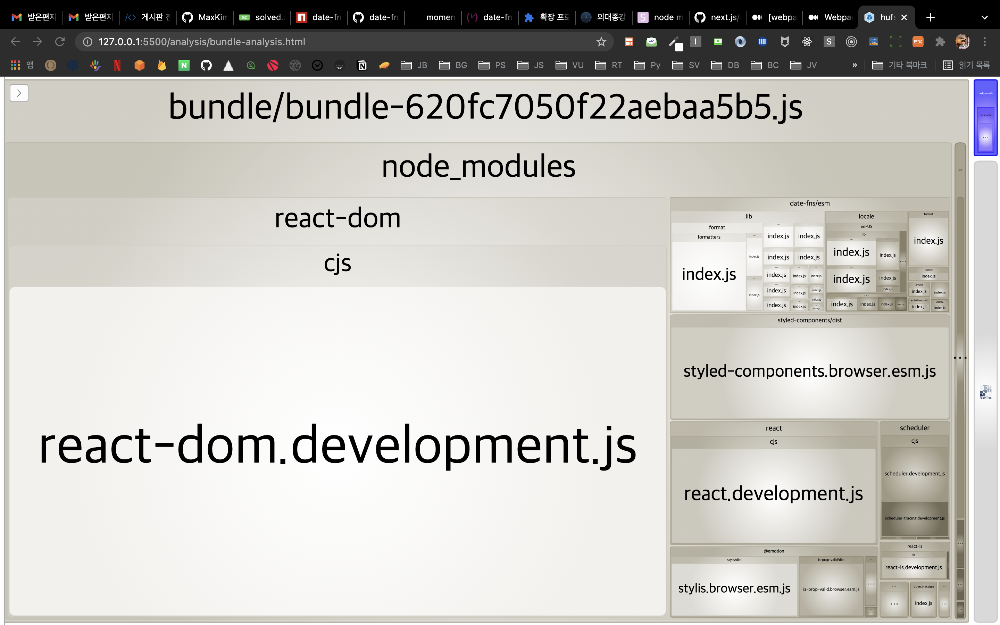
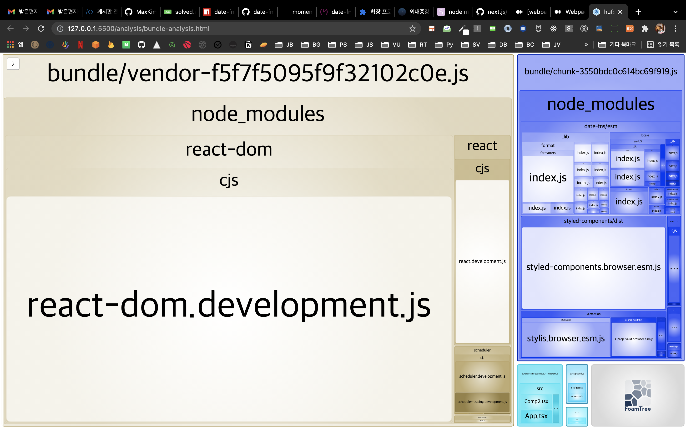
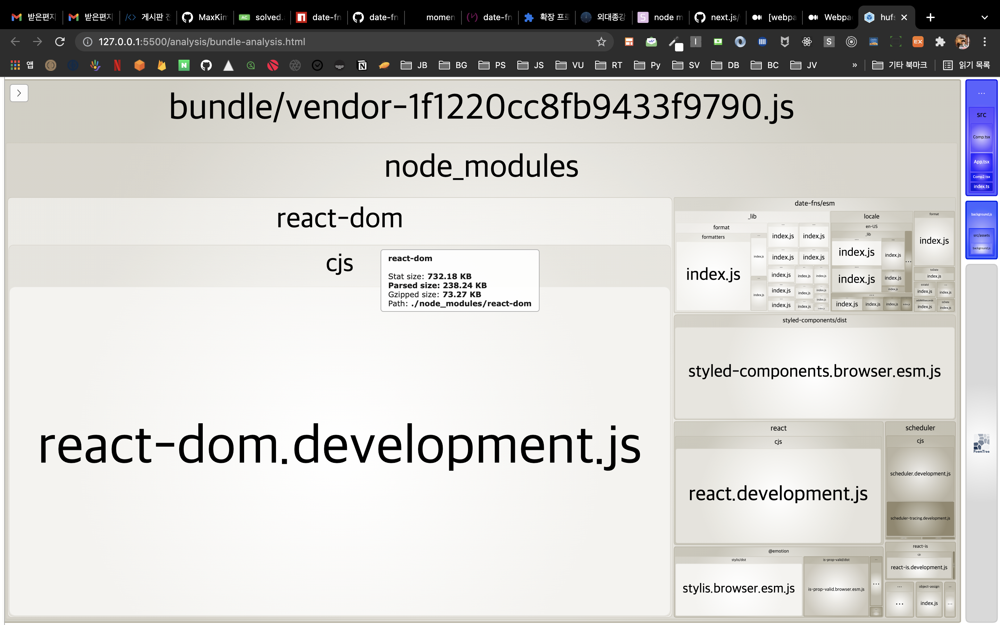
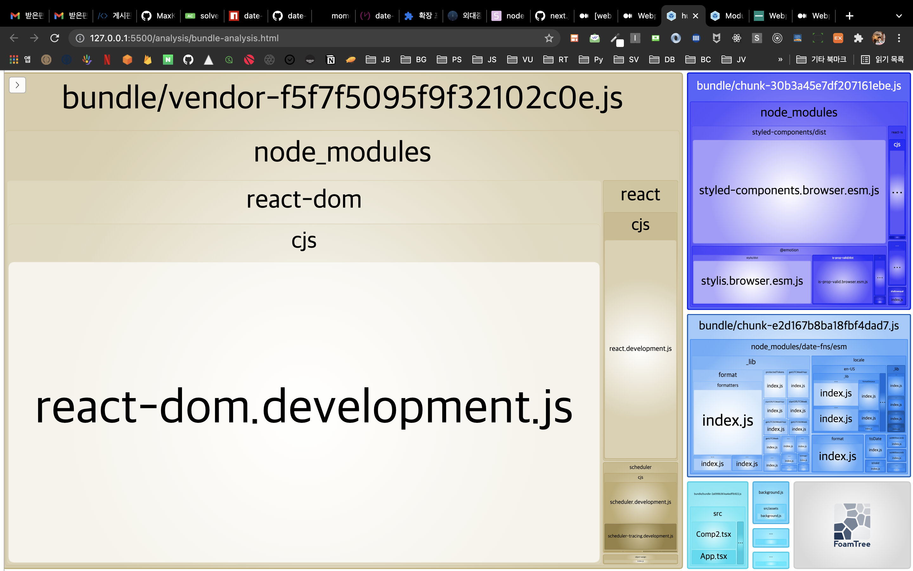
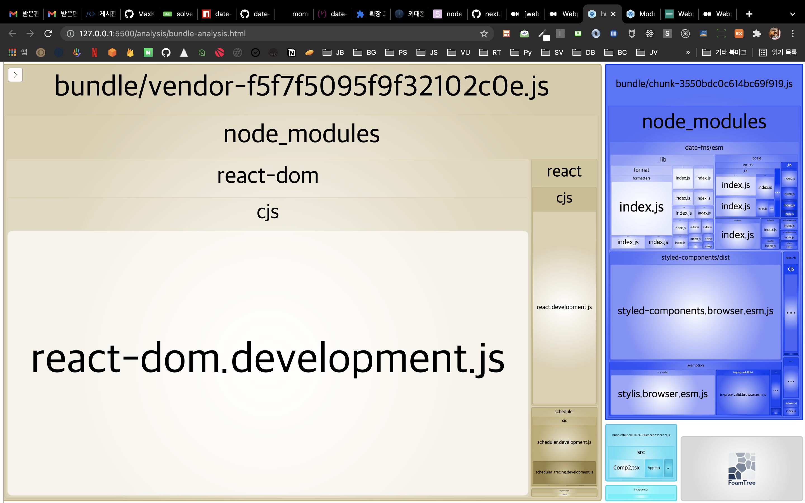

# Webpack을 열심히 한 번 살펴봤다

## 웹팩의 내부 동작

[Webpack Concept](https://webpack.js.org/concepts/)  
[webpack-how-it-generates-the-bundle](https://nearsoft.com/blog/webpack-how-it-generates-the-bundle/)

- 이건 한번 시간을 내서 튜토리얼로 번들러 만들어보면 좋지 않을까 싶다

## output

컴파일된 파일을 디스크에 쓴다

- 진입점은 여러개일 수 있지만 outputPath는 하나다

- assetModuleFileName : 에셋 모듈용 파일 아웃풋 네임(Webpack 5 에셋 모듈)
- charset: 최신이 아닌 브라우저와의 호환성을 위해 webpack은 여전히 charset을 기본적으로 추가한다.
- chunkFileName : 초기 번들이 아닌 청크 파일의 이름을 결정한다.
- publicPath : 애플리케이션 모든 asset들의 기본 경로를 지정할 수 있다.
- compareBeforeEmit : 출력 파일 시스템에 쓰기 전에 내보낼 파일이 이미 존재하고 동일한 내용이 있는지 확인
- filename : 각 출력 번들의 이름

### Template Strings

[name] 이렇게 생긴것들 종류

- 청크 수준
  - id : 청크의 identifier
  - name : 청크의 이름, 설정되지 않은 경우 청크의 ID
  - chunkhash : 청크의 모든 요소를 포함한 청크의 해시
  - contenthash : 콘텐츠 타입의 요소만 포함하는 청크의 해시
- 모듈 수준
  - id: 모듈 id
  - hash : 모듈의 해시
  - contenthash : 모듈 콘텐츠의 해시
- 파일 수준(file loader)
  - file : 파일 이름
  - query : 앞에 ?가 있는 쿼리
  - fragment : 앞에 #가 있는 쿼리
  - base : 경로 없이 확장자를 포함한 파일 이름
  - path : 파일 이름을 제외한 경로
  - ext : . 으로 시작하는 확장자

## loader + 자주 쓰는 loader들의 동작

당연하지만 자원에 따라 동작이 다르다

- loader는 모듈을 입력받아 원하는 형태로 변환한 후 새로운 모듈을 출력한다.
- 로더 적용 순서 : 특정 파일에 대해 여러개의 로더를 사용하는 경우 오른쪽에서 왼쪽 순서로 적용되기 때문에 scss는 sass-loader을 쓴 다음에 css-loader로 이동해야 한다.

```js
module: {
  rules: [
    {
      test: /\.scss$/,
      use: ["css-loader", "sass-loader"],
    },
  ];
}
```

- file-loader : 주로 이미지 파일(png, svg, jpg)등을 처리할때 사용한다. 번들링된 결과물은 dist내부로 복사된다. output의 publicPath 속성을 설정하면 img 태그의 src 속성들이 public 디렉토리 내부의 번들링된 이미지를 가리킨다.
  - outputPath: 로더를 거친 파일들이 번들링될 위치 설정
  - publicPath: 타겟 파일들에 대한 publicPath를 설정. 이거 따로 설정 안하면 output의 publicPath를 따라가는 듯 함
- css-loader, style-loader : css-loader는 CSS 파일을 평가하고, style-loader는 HTML 문서의 head 영역 안에 인터널 방식으로 스타일 코드를 추가한다.
  - MiniCssExtractPlugin : 이렇게 head로 넣는 방식이 아니라 별도 파일로 추출한다. CSS 코드가 포함된 JS 파일 별로 CSS 파일을 생성한다.
  ```js
   {
      test: /\.css$/i,
      use: [MiniCssExtractPlugin.loader, "css-loader"],
    },
  ```
  - CSS에서 url 함수에 파일명을 지정할 수 있는데 이를 모듈에서 발견하면 웹팩은 file-loader을 통해 파일을 복사한다.
- url-loader : 작은 이미지나 글꼴 파일은 복사하지 않고 문자열 형태로 변환하여 번들 파일에 넣어버린다. Data URL Scheme을 사용한다. 아이콘처럼 용량이 적거나 반복해서 사용하지 않는 이미지의 경우 이렇게 처리하면 유용하다.
  - 특정 용량을 넘지 않는 특정 확장자의 파일들을 URL로더로 처리할 수 있게 옵션을 줄 수 있다.
  ```js
  {
    test: /\.svg)$/,
    use: {
      loader: 'url-loader',
      options: {
        name: '[name].[ext]?[hash]',
        publicPath: './dist/',
        limit: 10000 // 10kb
      }
    }
  }
  ```
- babel-loader : 번들링 결과물에 바벨을 적용할 수 있게 해준다
- ts-loader : tsconfig.json을 찾아서 타입스크립트를 컴파일한다

## Optimization

minimize랑 splitchunks를 제외하면 일반적인 경우에 크게 커스텀할 것은 없어보이고, 대부분 production에서 기능하는 최적화 옵션을 키고 끄기 위해 이용되는 듯 하다.

- **minimize**: TerserWebpackPlugin을 사용하여 번들 결과물을 minimize(압축)하는 옵션
  - [terser](https://github.com/terser/terser) : ES6+를 위한 mangler, compressor 툴이다. uglify-es의 포크로 uglify를 계승한 압축 툴이다.
  - terser plugin의 설정을 변경하려면 minimizer 옵션을 쓴다
- **splitchunks**: 공통 청크 옵션
- nodeEnv : webpack이 process.env.NODE_ENV를 주어진 문자열로 설정하게 한다. 원래는 mode 설정값을 그대로 따라간다
- removeAvailabeModules : 모듈이 이미 상위에 포함되어있는 경우 청크에서 해당 모듈을 감지하고 제거한다. Production 모드에서는 기본적으로 활용함
- providedExports : export 절에서 보다 효율적인 코드를 생성하기 위해 모듈에서 어떤 export가 제공되는지 파악한다. 기본적으로 활성화
- removeEmptyChunks : 빈 청크를 감지하고 제거한다 디폴트로 true
- sideEffects: package.json의 sideEffect를 인식한다. 사이드 이펙트 없음으로 플래그된 모듈은 export가 사용되지 않을 때(모듈이 사용되지 않을때?) 건너뛴다. => 뒤에서 더 자세히 알아보자
- innerGraph : 사용되지 않은 export에 대해 내부 그래프 분석을 수행할지 결정한다

## SplitChunks 옵션의 동작과 활용

진입점이 index.ts 하나인 React 프로젝트를 기본으로 실험해봤다.(외대 종강시계 v2)

### Default로 적용

기본 캐시 그룹이 존재한다(default, vendors). 비활성화 하려면 false를 주면 된다. 근데 이게 어떤 차이고 정확이 무슨 느낌인지 잘 모르겠다. Next.js의 webpack.config에서는 두 옵션에 다 false를 주고 시작한다.

- 새 청크가 20kb보다 클 경우
- 청크를 공유할 수 있거나 모듈이 node_modules 내부에 있는 경우
- 요청시 청크를 로드할 때 병렬 요청수가 30개 이하일 경우
- 초기 페이지 로드 시 최대 병렬 요청 수가 30개 이하일 경우

### chunks 옵션

cacheGroups로 vendor을 설정하고 test 값으로 node_modules를 주자

```js
 optimization: {
    splitChunks: {
      cacheGroups: {
        vendor: {
          test: /[\\/]node_modules[\\/]/,
          chunks: 'initial',
          filename: 'bundle/vendor-[contenthash].js',
          priority: 1,
        },
      },
    },
  },
```

chunks의 옵션값과 효과는 다음과 같다.

- async : 비동기로 동적 import된 모듈을 다른 번들로 묶는다
- initial: 정적 import된 모듈을 다른 번들로 묶는다
  
- all : 어떻게 import되었든 import된 모듈을 번들로 묶는다.
- entry가 여러개라면 특정 엔트리 파일에서 import되는 모듈들은 각자의 번들에 들어간다. 엔트리가 여러개인 상황에서 splitchunk 옵션을 설정하면 공통 의존성을 다른 모듈로 빼준다.
- 2개 이상의 모듈에서 사용된 공유 모듈은 또 다른 번들로 빼준다 => 이거 React가 아닌 다른 상황, entry가 2개 이상인 상황에서 한번 더 실험해보면 좋을듯

#### 엔트리가 하나일 때

- React 파일을 번들하는 엔트리가 하나면 딱히 효용이 없는건가..? : 싶었는데 아니고 엔트리가 하나라도 splitchunk node_module 설정하면 node_modules에 있는거 따로 빼준다. 설정을 해줬을 때에 App.tsx의 번들이 빠져있는 걸 보면 알 수 있다.
- entry가 하나일때 splitChunks 위와 같은 옵션을 줬음 : App.tsx는 따로 묶이고, node_modules에 있는 의존성들은 vendor 하나로 묶인다.


- entry가 하나일 때 splitChunks 위와 같은 옵션을 안 줬음 : 모든 의존성들과 함께 App.tsx도 하나의 아웃풋 번들에 포함된다.



### 그 외 잘 사용되는 옵션들

- priority : 모듈은 여러 캐시 그룹에 속할 수 있는데, cacheGroups들 중에서 우선순위가 더 높은 캐시 그룹으로 들어간다.
- test : 캐시 그룹에 대해 선택되는 모듈을 제어한다. 절대 경로 모듈 리소스, 또는 청크 이름과 일치할 수 있음. 정규표현식 사용할 수 있다.
- filename : 초기 청크인 경우 파일 이름을 재정의할 수 있음
- enforce : 윗단 splitchunks 객체에 설정한 옵션들을 무시하고 항상 이 캐시 그룹에 대한 청크를 하위 옵션에 따라 생성하도록 지시한다.

### splitchunk initial + code splitting 같이 썼을 때의 동작

cond splitting이랑 splitchunk를 같이 쓰면 스플릿한 번들안에서만 사용하는 라이브러리들은 원래 나눠졌던 벤더 말고 또 별도의 번들로 분리된다.

splitchunk옵션은 async나 all 주면 벤더로 분리되고, initial을 주면 chunk로 분리된다. 어쨌든 분리는 된다

역시 2개 컴포넌트 이상에서 사용하는 라이브러리는 진작에 vendor로 분리된다. 코드 스플리팅한 컴포넌트가 불러와질때 해당 벤더도 같이 불러와진다. 특정 컴포넌트에서만 사용하는 라이브러리들을 격리해서 번들 속에 넣어줄 수 있고 필요할 때만 불러올 수 있다.



코드 스플리팅을 사용하지 않고, 옵션을 initial로 설정하면 모든 모듈들이 다 vendor로 들어간다.



그렇다면 코드 스플리팅을 한 컴포넌트가 2개이고, 2개의 스플리팅된 컴포넌트에서 각각 같은, 혹은 다른 라이브러리를 사용하면 어떻게 될까? 역시 한 컴포넌트에서만 사용된 라이브러리는 독립된 청크로 묶여서 해당 컴포넌트 불러올 때 같이 불러와지고, 두 곳에서 사용된 같은 라이브러리는 한 번만 묶인다




목적은 잘 달성하고 있지만 컴포넌트와 라이브러리 청크가 따로 묶이는게 아쉽다. 다 같이 묶이면 리퀘스트를 한번 줄일 수 있을 것 같다. 방법이 없을까..? 연구해봐야겠다..

### 번들을 나누는 일반적인 기준

각 코드 번들은 얼마나 커야 하는걸까???

어떻게 나눠야 가장 빠를까?  
리퀘스트 횟수 줄이기?

### 코드 스플리팅 전략

## TreeShaking

package.json의 sideEffects 이해하기

### 웹팩의 TreeShaking

## Sourcemap

- Inline sourcemap

## Output의 모듈 시스템 그리고 Rollup

### Webpack의 Output 속성

## 뭐 하는지 잘 몰랐던 속성들
