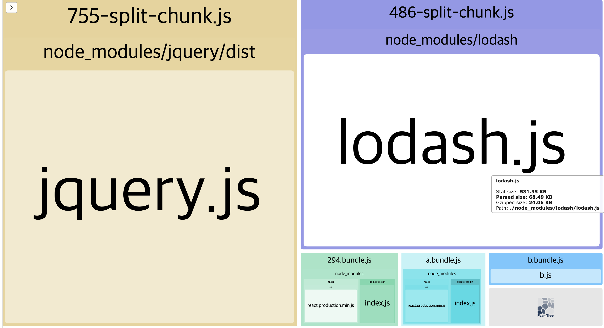
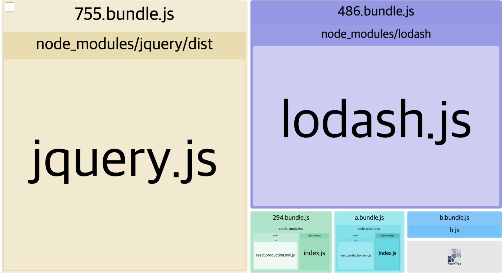
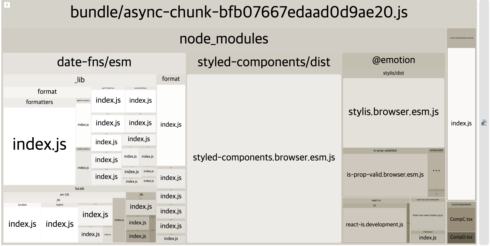
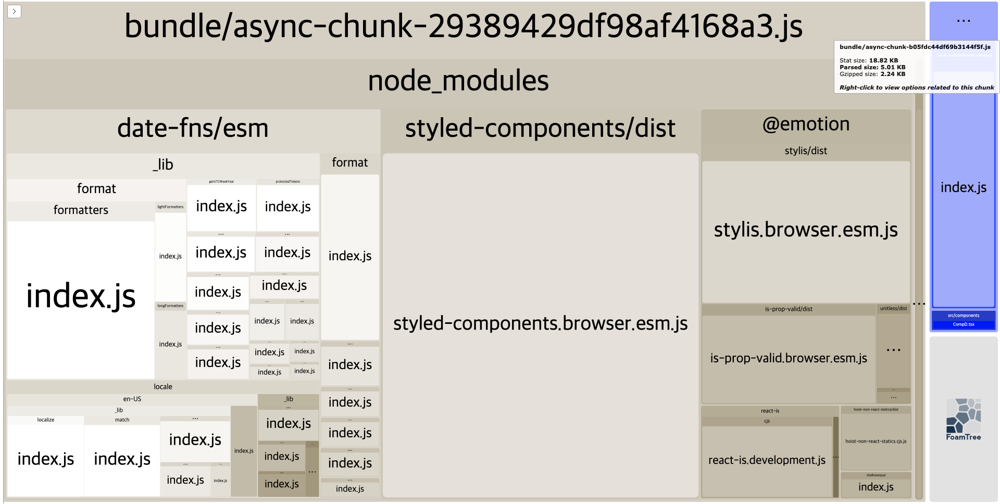
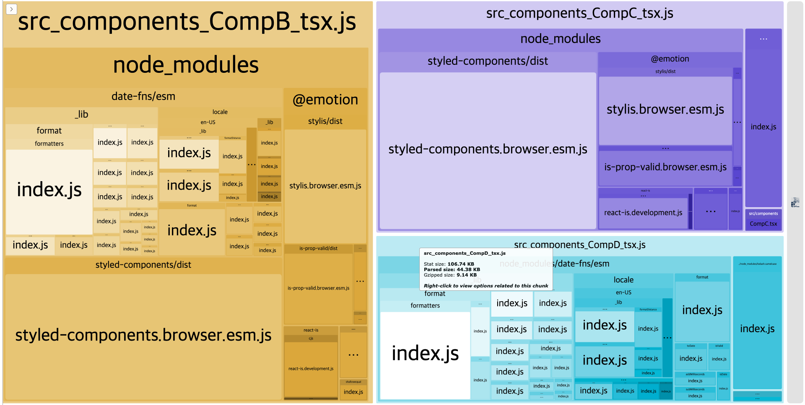
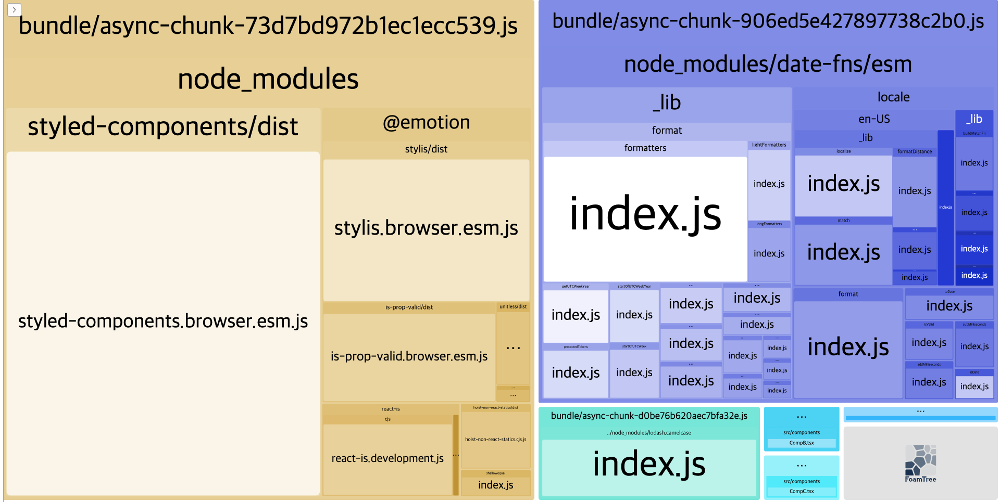

# Webpack Code Splitting

웹팩단에서 코드를 나눌 수 있는 SplitChunks와 RuntimeChunks, 그리고 React에서의 컴포넌트 코드 스플리팅을 살펴봅니다

## SplitChunks

여러 청크(번들)들 간에 공통적으로 사용되는 모듈들을 다른 번들로 모아주는 역할을 하는 optimization 옵션

### 주요한 옵션

- priority : 모듈은 여러 캐시 그룹에 속할 수 있는데, cacheGroups들 중에서 우선순위가 더 높은 캐시 그룹으로 들어간다.
- test : 캐시 그룹에 대해 선택되는 모듈을 제어한다. 절대 경로 모듈 리소스, 또는 청크 이름과 일치할 수 있음. 정규표현식 사용할 수 있다.
- filename : 초기 청크인 경우 파일 이름을 재정의할 수 있음
- enforce : 윗단 splitChunks 객체에 설정한 옵션들을 무시하고 항상 이 캐시 그룹에 대한 청크를 하위 옵션에 따라 생성하도록 지시한다.

### chunks 옵션

chunks의 옵션값과 효과는 다음과 같다.
[splitChinksPlugin 옵션 파헤치기](https://simsimjae.medium.com/webpack4-splitchunksplugin-%EC%98%B5%EC%85%98-%ED%8C%8C%ED%97%A4%EC%B9%98%EA%B8%B0-19f5de32425a)

```js
 optimization: {
    splitChunks: {
      cacheGroups: {
        vendor: {
          test: /[\\/]node_modules[\\/]/, // 번들링의 타겟
          chunks: 'initial', // 이거
          filename: 'bundle/vendor-[contenthash].js', // 번들 이름
          priority: 1
        }
      }
    }
  }
```

일단 기본적으로, 비동기 임포트된 모듈은 알아서 따로 분리된다는 걸 주지하면 좋을듯 하다. 그냥 비동기라서 분리된거랑, splitChunks 옵션때문에 공통 비동기 모듈이 분리되는거랑 다르다. cacheGroups 옵션에 filename 옵션을 주고 양상을 보면 어떻게 다른지 알 수 있음

- async : 결과물 번들 중에서 비동기로 동적 import된 모듈들 중 공통된 모듈을 다른 번들로 묶는다
  - entry가 여러 개일 경우 결과물 번들도 여러개, async로 설정해놓으면 그 다수의 번들 중 공통으로 동적 임포트되어있는 모듈들은 다른 모듈로 분리
  - 이 옵션만 설정했을 때는 여러 개 entry에 있는 모듈들 중 정적으로 임포트된 것들 중 겹치는 것들은 각 번들에 중복해서 들어간다.
  - 비동기 모듈은 따로 파일을 분리해야 동적으로 불러올 수 있기 때문에 비동기로 import하는 순간 무조건 별도의 파일로 분리된다.
  - 그러니까 async 옵션에 의거해서 공통으로 동적 임포트된 모듈 번들 따로, 또 동적으로 임포트된 번들은 또 다른 번들로 분리
  - async 옵션을 따로 설정하지 않는 상황에서 다수의 모듈에서 동적 임포트로 같은 모듈을 불러올 경우 번들은 하나만 생긴다.
  - 두개의 번들에서 같은 모듈을 불러올 때 하나는 동적임포트, 다른 하나는 정적 임포트라면 동적 임포트된 모듈은 독립된 번들로 분리되고, 정적 임포트는 그대로 번들에 있다. 같은 모듈이 다르게 나눠지는 것.
- initial: 결과물 번들 중에서 동기로 정적 import된 모듈들 중 공통된 모듈을 다른 번들로 묶는다
  - entry가 여러 개일 경우 결과물 번들도 여러개, initial로 설정해놓으면 그 다수의 번들 중 공통으로 정적 임포트되어있는 모듈들은 다른 모듈로 분리
  - 위에서 언급했듯이 비동기 모듈은 지가 알아서 따로 분리된다
  - 그러니까 initial을 설정한 경우에는, 기본적으로 동적으로 임포트 된거는 각각 따로 분리되고, 번들에서 동적으로 임포트된 공통 모듈이 묶여서 따로 분리되지는 않는다. 정적으로 임포트된 공통 모듈은 따로 번들로 분리되고, 특정 모듈에서만 불러오는 정적 모듈은 그대로 존재한다.
- all : import 방법과 관련 없이 import된 모든 모듈중 번들로 묶는다.
  - 공통으로 동적 임포트된 모듈, 정적 임포트된 모듈 다 번들 하나로 묶는다
  - 역시 여기서도 비동기로 임포트된 모듈은 따로 빠진다.
- [이 포스팅](https://simsimjae.medium.com/webpack4-splitchunksplugin-%EC%98%B5%EC%85%98-%ED%8C%8C%ED%97%A4%EC%B9%98%EA%B8%B0-19f5de32425a)의 예제에서는 all과 initial이 최종 번들 결과물은 똑같은데, 어떤 옵션이 관여해서 번들링했는지가 다르다.
  - 번들간 공통된 비동기 모듈 사용시 독립 번들을 하나만 만들기 때문이다. 이거는 웹팩단의 모종의 최적화인듯
  - 캐시그룹에 파일네임 옵션 넣고 돌려봄(bundle 대신 split-chunks)
  - all일 경우 - lodash가 들어있는 번들 이름을 보셈
    
  - initial인 경우
    

### Default로 적용

기본 캐시 그룹이 존재한다(default, defaultVendors).
아무것도 안 했을 때는 다음과 같이 적용된다.
비활성화 하려면 옵션 이름에 false를 주면 된다. 기본 설정은 다음과 같음.

```js
module.exports = {
  //...
  optimization: {
    splitChunks: {
      chunks: "async", // 여기다가 따로 주는게....이게 그 기본으로 들어가는 비동기 모듈 분리인가?
      minSize: 20000,
      minRemainingSize: 0,
      maxSize: 0,
      minChunks: 1,
      maxAsyncRequests: 30,
      maxInitialRequests: 30,
      automaticNameDelimiter: "~",
      enforceSizeThreshold: 50000,
      cacheGroups: {
        defaultVendors: {
          // node module에 있는 것들
          test: /[\\/]node_modules[\\/]/,
          priority: -10,
        },
        default: {
          minChunks: 2,
          priority: -20,
          reuseExistingChunk: true,
        },
      },
    },
  },
};
```

## RuntimeChunks

[Webpack을 활용한 성능향상 - 캐싱 활용하기](https://yceffort.kr/2020/07/make-use-of-long-term-caching#%EB%94%94%ED%8E%9C%EB%8D%98%EC%8B%9C%EB%A5%BC-%EC%B6%94%EC%B6%9C%ED%95%98%EC%97%AC-%EB%9F%B0%ED%83%80%EC%9E%84%EC%97%90%EC%84%9C-%EB%B3%84%EB%8F%84%EB%A1%9C-%EC%8B%A4%ED%96%89%ED%95%98%EA%B8%B0)

```js
// 대충 이렇게 생긴, 복잡한 코드가 들어있는 즉시 실행 함수이다. 사실 꽤 길다
(()=>{"use strict";var e,r,t,o,n,a={},i={};....)()})();
```

웹팩의 런타임 코드를 따로 분리하는 옵션이다.

- 런타임 코드는 초기에 청크를 로딩하는 역할을 수행한다.
- 웹팩은 런타임 코드를 엔트리 포인트당 하나씩 생성하고 번들에 넣는다.
- 런타임이 들어가있는 번들은 번들 결과물이 바뀔때마다 코드 조각이 바뀌게 되고, 종국적으로는 런타임이 들어가있는 번들의 내용을 바꾼다. => `[codehash]`로 filename을 지정하면 진짜 이런지 알 수 있을듯?
- runtimeChunk를 true로 주면 runtime을 분리한 번들이 엔트리 갯수별로 더 생긴다.
- CRA는 아래와 같은 방식으로 런타임 코드를 분리하고 있다.

```js
 runtimeChunk: {
    name: entrypoint => `runtime-${entrypoint.name}`,
  },
```

## React에서 splitchunk initial + dynamic import 같이 썼을 때의 동작

이제 실제 개발단에서의 예제를 살펴보자  
splitChunks 옵션은 React 개발에서는 어떤 영향을 미칠까?

#### React에서의 code splitting 특징

- CSR에서 React에서는 주로 entrypoint가 하나임(index.ts) - 많은 상황에서 initial 옵션은 별로 크게 기능을 안할 확률이 높음. 번들 결과물이 원칙적으로 하나이기 때문!
  - Next코드를 보니 SSR은 엔트리가 여러개인거 같음. 이런 경우에는 페이지 별로 공통 모듈을 뽑아내는 걸 할 수 잇겠지만 아마 불필요할듯
- React에서는 모듈이 아니라 주로 컴포넌트 단위(혹은 페이지 단위)로 코드 스플리팅을 함 - 컴포넌트 단위로 스플리팅이 된다면 컴포넌트가 임포트하는 다른 모듈들이나 컴포넌트는 어떤 취급을 받게 되고, 컴포넌트 렌더링 트리는 어떤 모습이 될까?

#### 동적 임포트 코드 스플리팅이 렌더링 트리에 미치는 영향

동적 임포트된 컴포넌트는 렌더링 트리의 리프까지 모두 뜯겨진다

어떤 한 컴포넌트에서 다른 컴포넌트를 동적으로 임포트 했을 경우, 번들은 자동으로 분리되고 그 컴포넌트 이하에 있는 모든 렌더링 트리의 서브트리에 해당하는 컴포넌트들과 모듈 역시 모두 그 비동기 번들에 들어간다.

```jsx
const CompC = lazy(() => import('./components/CompC'));

const App = () => {
  return (
    <Suspense fallback={<div>로딩</div>}>
      <CompC>
    </Suspense>
  )
}
```

```jsx
import { format } from 'date-fns';
import styled from 'styled-components';
import CompD from './components/CompB';

const StyledDiv = styled.div`
  color:red;
`

const CompC = () => {
  return (
    <StyledDiv>
      {format(new Date(1996,8,20), 'yyyy')}
    </StyledDiv>
    <CompB>
  )
}
```

```jsx
import camelcase from "lodash.camelcase";

const CompD = () => {
  return <div>{camelcase("im_component")}</div>;
};
```

이런 경우에 CompC를 번들링하는 비동기 번들은 이렇게 나온다. 서브트리를 뜯어 번들을 만든 것이다.



만약에 여기서 CompD를 비동기적으로 가져온다면, 또 CompD 이하부터 뜯어가지고 또 비동기 번들을 따로 만들게 된다. CompD가 lodash camelcase와 함께 분리된 다른 청크가 하나 더 생겼다.



#### 동적 임포트된 모듈끼리의 공통 모듈 분리

앞에서 일반적인 React 프로젝트는 웹팩 설정에서 entry가 하나이기 때문에 정적 import된 공통 모듈을 분리하는 initial 옵션은 크게 이점을 주지 않는다고 말했다.

```jsx
const CompB = lazy(() => import('./CompB'));
const CompC = lazy(() => import('./CompC'));
const CompD = lazy(() => import('./CompD'));

const App = () => {
  return (
    <Suspense fallback={<div>로딩</div>}>
      <CompB>
      <CompC>
      <CompD>
    </Suspense>
  )
}
```

```jsx
// date-fns와 styled-component
import { format } from "date-fns";
import styled from "styled-components";

const StyledDiv = styled.div`
  color: red;
`;

const CompB = () => {
  return <StyledDiv>{format(new Date(1996, 8, 20), "yyyy")}</StyledDiv>;
};
```

```jsx
// styled-component과 lodash camelcase
import camelcase from "lodash.camelcase";
import styled from "styled-components";

const StyledDiv = styled.div`
  color: blue;
`;

const CompC = () => {
  return <StyledDiv>{camelcase("im_component_C")}</StyledDiv>;
};
```

```jsx
// date-fns와 lodash camelcase
import camelcase from "lodash.camelcase";
import { format } from "date-fns";

const CompD = () => {
  return (
    <>
      <div>{format(new Date(1996, 8, 20), "yyyy")}</div>
      <div>{camelcase("im_component_D")}</div>
    </>
  );
};
```

일단 아무런 splitChunks 옵션도 주지 않고 코드 스플리팅을 사용하면, 코드 스플리팅된 각 번들 중에 공통 모듈이 있더라도 분리되지 않는다. 겹치는 모듈이 비동기로 분리된 청크에 들어가있음을 알 수 있다.



그런데 async 옵션을 사용하면, 이렇게 비동기로 분리된 청크에 대해 공통 모듈을 추출해 다른 청크로 만든다. 먼저 위의 예시는 다음과 같이 분리될 수 있음



세 컴포넌트에 모두 똑같은 모듈이 사용되었을 경우에는 한 번들로 분리해냄


일단 두 컴포넌트의 기준으로 공통 모듈을 분리해내는거 아닌가 싶다(minChunks=2?). 하여튼 이런식으로 async 옵션을 쓰면 코드 스플리팅된 모듈 사이의 공통 모듈을 추출할 수 있다.

근데 위의 예제에서 봤듯이 모든 모듈이 단일 번들로 나와버리는 수가 있고 그렇게 되면 번들 수가 의도하지 않게 많아지므로, 어느정도 분리해야할 모듈들이 예상이 된다면, 모듈을 지정하여 번들로 만들어버리거나, 밑에 Next의 예제처럼 페이지 단위의 공통 모듈들을 추출해 따로 청킹하는 방법을 사용할 수 있겠다.

#### CRA의 SplitChunks 옵션

따로 캐시그룹은 없고, all로 뜯는다

```jsx
  splitChunks: {
    chunks: 'all',
    name: isEnvDevelopment,
  },
```

#### Next의 SplitChunks 옵션

- 위처럼 async로 비동기 모듈들을 나눌 수도 있지만, minChunks 등으로 공통 모듈을 더 매니징하여 나눌 수도 있다.
- SSR하려면 엔트리가 페이지 단위로 나눠져야 할 것이다. 각 페이지에서 사용하는 단일 번들들이 기본적으로 만들어질 것이라고 예상해본다..
- Next 안쪽 코드 보는거 재미있는거 같다
- 스플리팅된 모듈들 전체를 따져서 공통 모듈을 빼내는 거 괜찮은 아이디어같다

```ts
const splitChunksConfigs: {
  [propName: string]: webpack.Options.SplitChunksOptions;
} = {
  // dev일때는 이게 다인가보네
  // 걍 default도 안쓰고 아무것도 안함
  dev: {
    cacheGroups: {
      default: false,
      vendors: false,
      // In webpack 5 vendors was renamed to defaultVendors
      defaultVendors: false,
    },
  },
  // 아마 production 환경일때
  prodGranular: {
    chunks: "all",
    cacheGroups: {
      // 기존 옵션은 모두 쓰지 않음
      default: false,
      vendors: false,
      // In webpack 5 vendors was renamed to defaultVendors
      defaultVendors: false,

      //! Framework: React등 주요 프레임워크들 분리 쉽게변하지 않음
      framework: {
        chunks: "all",
        name: "framework",
        // This regex ignores nested copies of framework libraries so they're
        // bundled with their issuer.
        // https://github.com/vercel/next.js/pull/9012
        test: /(?<!node_modules.*)[\\/]node_modules[\\/](react|react-dom|scheduler|prop-types|use-subscription)[\\/]/,
        priority: 40,
        // Don't let webpack eliminate this chunk (prevents this chunk from
        // becoming a part of the commons chunk)
        enforce: true,
      },

      //! lib : node module에 포함되어 있고 module이 일정 크기(160000) 이상인것
      lib: {
        test(module: { size: Function; identifier: Function }): boolean {
          return (
            module.size() > 160000 &&
            /node_modules[/\\]/.test(module.identifier()) //
          );
        },
        // 얘네 이름같은 경우는 해시 사용
        name(module: {
          type: string;
          libIdent?: Function;
          updateHash: (hash: crypto.Hash) => void;
        }): string {
          const hash = crypto.createHash("sha1");
          if (isModuleCSS(module)) {
            module.updateHash(hash);
          } else {
            if (!module.libIdent) {
              throw new Error(
                `Encountered unknown module type: ${module.type}. Please open an issue.`
              );
            }

            hash.update(module.libIdent({ context: dir }));
          }

          return hash.digest("hex").substring(0, 8);
        },
        priority: 30,
        minChunks: 1,
        reuseExistingChunk: true,
      },
      //! commons: 모든 페이지에서 넓게 공유되는 모듈은 추출
      // 먼저 로드된 페이지에서 로드되고, 다른 페이지 들어갈때는 캐싱
      commons: {
        name: "commons",
        // 특정 모듈이 이 캐시 그룹에 속하려면 minChunks에 설정된 숫자만큼의 청크에 포함이 되어야 한다.
        minChunks: totalPages, // const totalPages = Object.keys(entrypoints).length 페이지의 개수(error나 이런것도 들어가려나)
        // 페이지 수만큼 엔트리가 설정되나보다 음.. SSR이니깐 페이지별로 자바스크립트를 따로 번들링하는 것일까
        priority: 20,
      },
      //! shared : 2페이지 이상 공유하는 모듈들
      shared: {
        name(module, chunks) {
          return (
            crypto
              .createHash("sha1") // 해싱
              .update(
                chunks.reduce(
                  (acc: string, chunk: webpack.compilation.Chunk) => {
                    return acc + chunk.name;
                  },
                  ""
                )
              )
              .digest("hex") + (isModuleCSS(module) ? "_CSS" : "")
          );
        },
        priority: 10,
        minChunks: 2,
        reuseExistingChunk: true,
      },
    },
    maxInitialRequests: 25,
    minSize: 20000,
  },
};
```

## 번들을 나누는 이유

### UX 관점

컴포넌트 레이지 로딩. 모든 자원을 한꺼번에 가져올 필요 없음. 근데 이거는 앱의 양상에 따라 꽤 다른 전략을 사용할 수 있음

### 성능 관점

- 크기 : 크기가 큰 번들을 다운로드 받을때 시간이 오래 걸림
- 리퀘스트 횟수 : 크롬은 한 도메인당 최대 6개의 동시 요청이 가능하다. http2에서는 동시요청 제한이 없음. 번들을 나누면 동시요청 병렬처리의 이점을 이용할 수 있음
- 캐싱 : 스플리팅을 하면 청크가 많아져서 오히려 모든 청크를 가져오는데 시간이 더 들 수도 있으므로 이름으로 캐싱(chunkhash)같은걸 활용
