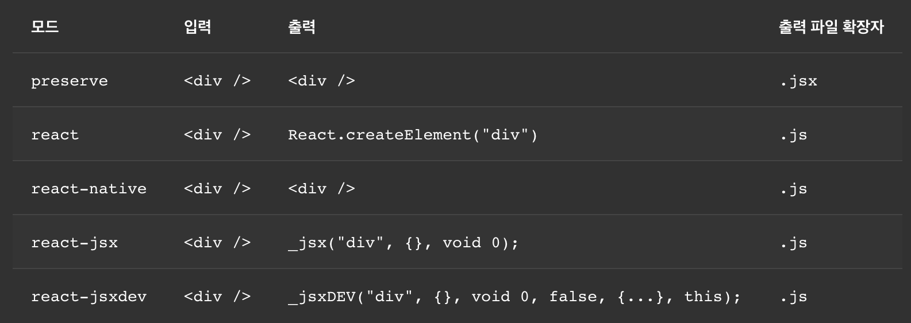

# 프론트엔드 툴링과 선택의 여지

## 순서가 중요한 것

tsx 컴파일 일반적인 순서 : 타입스크립트 -> JSX -> 자바스크립트

### babelrc vs webpack babel loader

루트 디렉토리에 babelrc 두기 vs Webpack Babel Loader에서 설정하기

- 결과의 차이는 없다.
- 기본적으로 루트에 babelrc를 두면 webpack loader가 찾아서 적용한다.
- babelrc의 경우 storybook을 사용할때 기본 바벨 설정이 되기도 해서, 루트 디렉토리에 바벨 설정 파일을 두는게 확장성에는 살짝 좋을 수 있다. 웹팩만을 위한 로더 설정인지 다른 런타임에도 적용 가능한 설정인지가 좀 다른 것

### Babel preset, plugin running order

바벨 플러그인과 프리셋은 어떤 순서로 적용될까?

- [바벨 독스에 따르면](https://babeljs.io/docs/en/plugins#plugin-ordering) 플러그인들은 프리셋 이전에 실행된다.
- 순서가 좀 독특함. 플러그인은 배열의 앞 인덱스부터 뒤로, 위에서 아래로 실행되고
- 프리셋은 배열의 맨 뒤 인덱스부터 앞으로, 즉 아래에서 위로 실행된다.
- 프리셋이 플러그인의 집합 정도의 의미라는 점에서, 사실 플러그인과 프리셋은 동등한 가치를 갖는다. 그렇기 때문에 플러그인과 프리셋을 섞어쓰면 플러그인들의 의도한 호출 순서가 꼬일 가능성이 있다. 어쩌면 바벨에 내제된 리스크일지도..?
- 관련해서 [논의와 PR](https://github.com/babel/babel/pull/5735)이 진행중이었다가 엎어진 것 같은데 최근에는 잘 모르겠다.
- 라이브러리 툴링 관련해서 문제가 생긴다면 바벨 플러그인과 프리셋의 순서를 살펴봐도 좋을 듯 싶다

### Webpack Loader applying order

웹팩 로더는 어떤 순서로 적용될까?

[스택오버플로우](https://stackoverflow.com/questions/32234329/what-is-the-loader-order-for-webpack)에 따르면

이거랑

```js
{
    test: /\.css$/,
    loaders: ['style'],
},
{
    test: /\.css$/,
    loaders: ['css'],
},
```

이게 같다

```js
{
    test: /\.css$/,
    loaders: ['style', 'css'],
},
```

- 수직으로 로더 전체 배열 안에 나열하면 위에 오는게 먼저 적용되고
- 수직으로 test아래 로더 배열에 적용하면 뒤에 오는게 먼저 적용된다
- 함수로 연달아 감싼다고 이해하면 쉽다 `style(css(file))`
- 그래서 SCSS 같은 경우 로더로 처리할때 `css-loader` `sass-loader` 이 순서로 두는 것
- 근데 한 파일 형식에 여러 개의 로더 설정을 두는게 쓸데없는 반복인거 같아서, 후자가 더 깔끔한 방식인듯 하다. 프로젝트의 어떤 자원이 있는지를 더 잘 표현하는 방식이기도 하고.
- 가령 tsx파일을 ts-loader와 babel-loader 두 개로 트랜스파일한다고 하면 대충 이런 식이 되는 것이다.

```js
{
    test: /\.tsx?$/,
    loaders: ['babel-loader', 'ts-loader'],
},
```

## 두 군대에서 할 수 있어서 선택의 여지가 있는 것

일반적인 리액트 프로젝트 기준 바벨과 타입스크립트 컴파일에서 모두 할 수 있는 트랜스파일 : Typescript, JSX, ES5

한 쪽에서 다 하는게 가능하다

### Typescript

> babel-typescript preset vs webpack ts-loader

- [이거는 꽤나 잘 알려져있는](https://ui.toast.com/weekly-pick/ko_20181220) 선택의 여지라고 할 수 있다.
- 위 글에서 두 개의 컴파일러를 함께 엮어 사용하는 것이 쉬운 일이 아니라는 말이 나오는데 동감한다. 순서도 굉장히 헷갈리고 신경써야 할 부분이 많다(TS -> TS Compile -> JS -> Babel -> JS) 
- 바벨이 컴파일이 더 빠르다 : 바벨은 타입스크립트를 **몽땅 제거**한다. 
  - ts-loader는 node_module 등에서 d.ts를 스캔하고 올바르게 동작하는지 확인하고, 옵션에 따라 index.d.ts를 만들어 줄 수도 있기 때문에 더 느리다.
  - 패키지 타입 선언이 포함되어야 하는 라이브러리 제작시에는 못 쓸 수도..? : 타입 선언을 만들어내는게 [지향점이 아니라고 한다.](https://github.com/babel/babel/issues/9668#issuecomment-602221154) 프리셋은 그냥 트랜스파일링만 한다. [이렇다고도 하고](https://stackoverflow.com/questions/62732580/creating-react-component-libraries-using-typescript-vs-babel-compiler)
  - [빌드 타임 비교](https://github.com/JaeYeopHan/tip-archive/issues/30)
  - 정말 엄청큰 프로젝트를 다뤄보고 비교해보지는 않았는데, 빌드 시간을 줄여야 할 경우 프로덕션 빌드에 바벨을 사용할 수도 있을듯
- **빌드시 타입을 체크하지 않는다** : 난 이게 좀 걸려서 아직까지는 ts-loader을 쓰는 편이기는 한데, eslint나 isolatedModules등의 기능을 켜면 어느정도 보완이 가능하다.
  - 그래도 [보일러플레이트 만들어보며](https://github.com/MaxKim-J/react-boilerplate) 꽤 괜찮다는 생각이 들었다..
- 미지원 문법 : 초창기의 babel-preset에는 const enum, class proeprties, object-rest-spread 등의 문법이 미지원이었음
  - preset-env랑 같이 쓰면 어느정도는 해결이 됨
  - 필요하면 플러그인 사용
  - tsc 쪽이 더 잘 지원된다고 알고 있는데 업데이트 거듭하면서 babel 쪽도 어떻게 개선되었는지 궁금

### JSX

#### JSX에 대한 사전정보

- React.createElement 함수에 대한 문법적 설탕이다.
- (원래는) React가 스코프 내에 존재해야 했다. React.createElement를 호출하는 코드로 컴파일되기 때문에 React 라이브러리 역시 JSX 코드와 같은 스코프 내에 존재해야만 했음
  - (이제는) 아님 [React 17 New Transform JSX](https://ko.reactjs.org/blog/2020/09/22/introducing-the-new-jsx-transform.html)
  - React.createElement 이런식으로 React에 의존하는 코드가 아니라, react/jsx-runtime이라는 패키지의 jsx 함수로 바꿔 JSX 문법을 핸들한다.

#### babel react-preset vs typescript jsx react option

- JSX에 대한 컴파일 옵션은 @babel/react-preset을 사용하거나 Typescript의 tsconfig의 JSX 옵션에서 사용할 수 있다.
- [이 글에 따라](https://ko.reactjs.org/blog/2020/09/22/introducing-the-new-jsx-transform.html)아래와 같이 하면 new JSX Transform을 지원하면서 결과물이 같기 때문에, 결국 순서의 차이라고도 할 수 있다.
```jsx
// babelrc
{
  "presets": [
    ["@babel/preset-react", {
      "runtime": "automatic" // 이렇게 설정해주면 jsx() 이렇게 바뀐다 default는 classic이다.
    }]
  ]
}

// tsconfig
{
  jsx: 'react-jsx',
  ...
}
```
- JSX가 처리되어야 하는 시점은 타입스크립트 트랜스파일 끝나고 ES5 컴파일을 하기 이전 시점이다. 그 타이밍이 보장될 수 있게만 처리해주면 된다.
- 타입스크립트를 아예 쓰지 않는 프로젝트라면 @babel/preset-react를 쓸수밖에 없을듯? 타입스크립트를 쓰는 환경이라 선택지가 생긴 것

#### Emotion을 쓰는 경우

이 경우에도 두 가지 선택지가 있다.

- @babel/preset-typescript 혹은 @babel/preset-react => @emotion/babel-preset-css-prop
  - `import { jsx } from '@emotion/react'`이게 자동으로 추가되고 `jsx('img', { src: 'avatar.png' })` 이런식으로 React.createElement를 변화시켜 CSS Props를 이해할 수 있게 된다.
  - 근데 이모션 독스에서는 new JSX Transform을 쓰려면 이걸 사용하지 말라고 한다. JSX 함수가 네임스페이스가 겹쳐서 그런건가
- tsconfig에서 `jsx:react-jsx, jsxImportSource: @emotion/react`로 설정하면 emotion을 이해할 수 있는 형태로 알아서 바뀐다.

### ES5

> babel preset-env vs typescript target ES5

- 이거는 바벨이 그냥 넘사다. 
- tsconfig로는 Module Target이랑 ES Target 정도밖에 설정 못하지만 babel로는 타겟 브라우저와 여러 플러그인 설정으로 정말 원하는 결과물을 더 다채롭게 낼 수 있다.
- 트리 쉐이킹을 위한 퓨어 어노테이션 지원도 더 잘된다고 한다.

## 기타 등등 알면 좋은 것

### tsconfig의 JSX 옵션



- preserve : JSX를 몽땅 살리고 babel같은 다음 변환 단계에서 JSX를 트랜스파일
- react : React.createElement로 바꾸고 다음 단계에서 JSX 변환이 필요 없다.(= @babel/react-preset이 필요 없다)
- react-jsx : React.createElement가 아니라 _jsx로 바꾼다 => new transform JSX, import React 이 구문을 쓸 필요가 없어진다.

### Babel Tree Shaking friendly Setting

### StoryBook Tooling